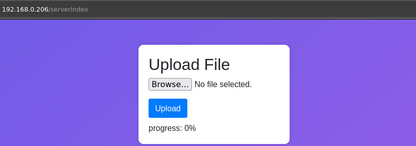
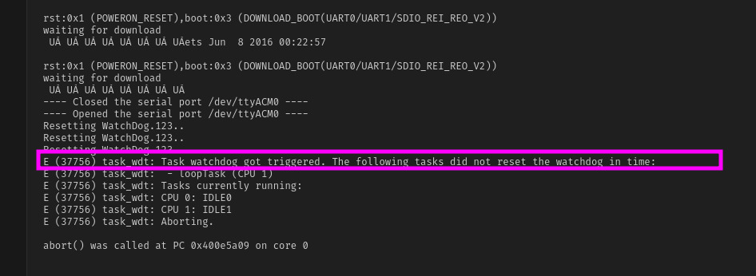

# my-esp32-template

A basic ESP32 template project to help me get started with any brand new ESP32 board. So, I thought it would be cool to share it with others.

It's a straightforward project that doesn't include anything overly complex, but it does offer the following features to help you get started right away.

### OTA updates

I used the existing Arduino IDE code for OTA and made some minor improvements to the login and firmware upload page's user interface.

### WatchDog

[Watchdog timer (WDT) is an important feature for hardware devices like ESP32 or Arduino that need to auto recover from all kind of unexpected failures.](https://iotassistant.io/esp32/enable-hardware-watchdog-timer-esp32-arduino-ide/)

[The Task Watchdog Timer (TWDT) is used to monitor particular tasks, ensuring that they are able to execute within a given timeout period.](https://docs.espressif.com/projects/esp-idf/en/latest/esp32/api-reference/system/wdts.html)

This can help us recover from certain behaviors that cause the ESP32 to become stuck. I've observed this issue on some ESP32-CAM boards, where the device would freeze after a few days or hours, requiring a manual power cycle. I believe that implementing a watchdog timer (WDT) will resolve these issues, as it will reset the board if it fails to report in within the specified time frame. The WDT is handled by the hardware, so if the timer expires, the board will automatically reset.

I tested this by forcing the WDT to bypass its reset, and I was able to confirm that the board was indeed reset, as shown below:

### Simple Health Check Mechanism

I have a private Telegram group where I receive notifications, and I've created a bot that sends a message to the group when the board is up and running. I've found this to be a simple way to monitor the board's status, but you can modify the behavior to suit your needs.

### TODOs

There are many areas for improvement, but this template provides a solid foundation that I can start using and build upon as needed. For now, I've identified the following areas for implementation:

- Wifi-Manager.
- Improve the security of OTA updates, as the current login page is a basic example that stores the password in plain text within the HTML (🤣) and does not prevent unauthorized access to the firmware upload page.
